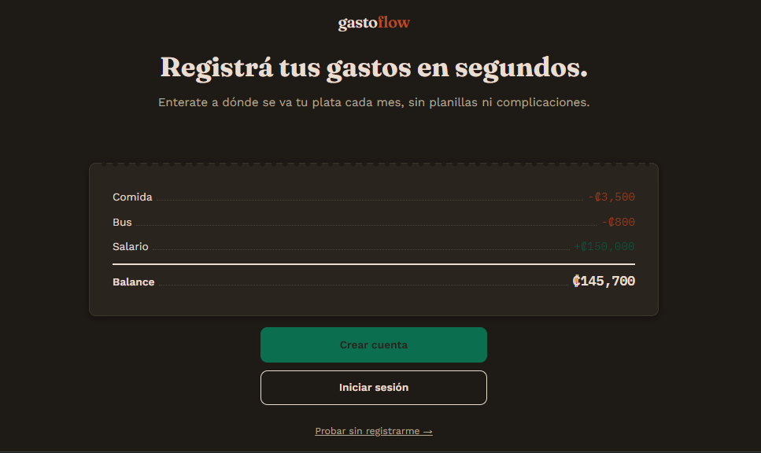

# GastoFlow

Aplicación web para registrar y controlar gastos e ingresos personales, construida con **Flask**, **SQLAlchemy** y **Flask-Login**. Permite crear cuenta, o probar la app sin registrarse mediante una cuenta de invitado temporal.

## Captura



## Demo

La versión en producción corre en **Render** con PostgreSQL:
👉 [gastoflow.onrender.com](https://gastoflow.onrender.com)

> El plan gratuito de Render puede tardar ~30 segundos en responder la primera vez si el servidor estuvo inactivo.

## Descripción general

GastoFlow permite:

- Registrar transacciones de **gasto** o **ingreso**, con categoría, fecha, monto, método de pago (efectivo/digital) y nota opcional.
- Ver un **dashboard mensual** con el balance del mes, totales de ingresos y gastos, gráfico de dona por categoría filtrable por método de pago, y alertas automáticas.
- **Programar transacciones** futuras o recurrentes (mensual, quincenal) que aparecen como pendientes en el dashboard cuando llega su fecha.
- Definir **presupuestos** por categoría con barra de progreso, y recibir alertas cuando se supera el 80% o el 100% del límite.
- Ver un **historial** filtrable por mes, semana, categoría y método de pago, con totales visibles del filtro activo y paginación.
- **Exportar** las transacciones del filtro activo a CSV.
- Gestionar **categorías** propias (crear, renombrar, eliminar) y actualizar nombre, email y contraseña desde el **perfil**.
- Recuperar contraseña olvidada vía email (requiere configurar MAIL_SERVER).
- Entrar como **invitado** sin registrarse, con una cuenta temporal que se elimina automáticamente tras varios días de inactividad.
- Consumir los datos vía una **API REST** autenticada con JWT, pensada para clientes externos (scripts, apps móviles).

[Documentación técnica detallada](DETALLES_TECNICOS.md)

## Branches

| Branch | Entorno | Base de datos | Orquestación |
|---|---|---|---|
| `main` (este) | Render + local | PostgreSQL (prod) / SQLite (local) | render.yaml + Dockerfile |
| `docker-prototype` | Local | MySQL | docker-compose.yml |

La rama `docker-prototype` es el prototipo original. Esta rama (`main`) es la versión en producción, con más funcionalidades y una arquitectura distinta. Ver [diferencias detalladas](DETALLES_TECNICOS.md#diferencias-con-el-prototipo-docker).

## Requisitos

- Python 3.12
- Para producción: cuenta en [Render](https://render.com) (plan gratuito disponible)
- Para desarrollo local: no necesita nada más — corre con SQLite sin configuración

### Dependencias de Python

```
Flask, Flask-SQLAlchemy, Flask-Login
Flask-WTF, Flask-Limiter, Flask-Mail
PyJWT, psycopg2-binary
python-dotenv, python-dateutil, gunicorn
```

## Desarrollo local (SQLite)

Sin variables de entorno configuradas, la app usa SQLite automáticamente. No necesita base de datos externa.

```bash
git clone https://github.com/OlmanOrtega/recuento_gastos.git
cd recuento_gastos

python3.12 -m venv venv
source venv/bin/activate      # Linux/Mac
venv\Scripts\activate         # Windows

pip install -r requirements.txt
python app.py
```

La app queda disponible en [http://localhost:5000](http://localhost:5000). Los cambios hechos localmente con SQLite no afectan la base de datos de producción en Render.

## Deploy en Render

El archivo `render.yaml` describe toda la infraestructura (servicio web + base de datos PostgreSQL) en un solo lugar. Render lo lee automáticamente y configura todo.

```bash
# En el dashboard de Render:
# New + → Blueprint → conectar el repo → Render levanta todo solo
```

Variables que Render configura automáticamente:
- `SECRET_KEY` → generada aleatoriamente por Render (`generateValue: true`)
- `DATABASE_URL` → URL de la base PostgreSQL creada en el mismo blueprint

Variable opcional que podés agregar manualmente si querés recuperación de contraseña por email:
- `MAIL_SERVER`, `MAIL_PORT`, `MAIL_USERNAME`, `MAIL_PASSWORD`, `MAIL_DEFAULT_SENDER`

> El plan gratuito de PostgreSQL en Render expira después de 90 días. Necesitás recrear la base de datos o migrar a un plan pago antes de esa fecha.

## Estructura del proyecto

| Archivo | Responsabilidad |
|---|---|
| `app.py` | Application factory: inicializa Flask, extensiones y blueprints. Incluye migración de schema liviana. |
| `models.py` | Modelos: `Usuario`, `Categoria`, `Transaccion`, `TransaccionProgramada`, `Presupuesto`, `TokenRecuperacion`. |
| `extensions.py` | Instancias compartidas de CSRF, Limiter y Mail. |
| `auth.py` | Registro, login, invitados, logout y recuperación de contraseña. |
| `dashboard.py` | Totales del mes, datos para el gráfico (por tipo y método), alertas y alertas de presupuesto. |
| `transacciones.py` | Alta, edición, eliminación, historial con filtros múltiples, paginación, totales y exportación CSV. |
| `programadas.py` | Transacciones futuras/recurrentes: crear, editar, confirmar, saltar y eliminar. |
| `presupuestos.py` | Límites de gasto por categoría con progreso mensual. |
| `perfil.py` | Cambiar nombre, email y contraseña del usuario. |
| `categorias.py` | Gestión de categorías propias. |
| `api.py` | API REST con autenticación JWT. |
| `render.yaml` | Blueprint de infraestructura para Render (servicio web + PostgreSQL). |
| `Dockerfile` | Imagen Docker con Gunicorn para producción. |

## Limitaciones conocidas

- Las alertas automáticas son reglas fijas (umbrales de porcentaje), no un modelo predictivo.
- La recuperación de contraseña requiere configurar un servidor SMTP externo. Sin esa configuración, el link de recuperación solo aparece en un mensaje flash (útil para desarrollo).
- La API (JWT) y la web (cookies de sesión) son sistemas de autenticación completamente separados.
- El plan gratuito de PostgreSQL en Render expira a los 90 días.
